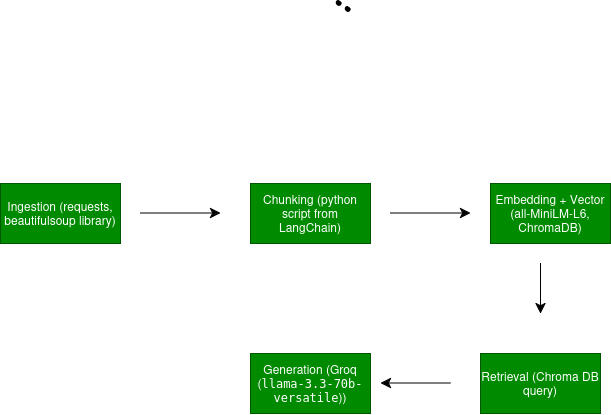

# Project 1 Planning: The Unofficial Guide

> Write this document before you write any pipeline code.
> Your spec and architecture diagram are what you'll use to direct AI tools (Claude, Copilot, etc.) to generate your implementation — the more specific they are, the more useful the generated code will be.
> Update the Retrieval Approach and Chunking Strategy sections if you change your approach during implementation.
> Update this file before starting any stretch features.

---

## Domain

<!-- What domain did you choose? Why is this knowledge valuable and hard to find through official channels? -->

I will chose to research student reviews of Organic Chemistry professors at the University of Houston.
It's very difficult for pre medical students to find out who is actually the best professor to prepare them correctly for tests and make the course fair. 
Some reviews can be outdated, syllabus can change or professor can implement new policies on a semester basis. Using only rate my professor is not good enough on its own and the extra compilation of different sources will help a student navigate their choice when building their schedule. 
---

## Documents

<!-- List your specific sources: URLs, subreddit names, forum threads, or file descriptions.
     Aim for at least 10 sources that together cover different subtopics or perspectives within your domain. -->

| # | Source | Description | URL or location |
|---|--------|-------------|-----------------|
| 1 | Ratemyprofessor | Student reviews of professors |https://www.ratemyprofessors.com/
| 2 | Reddit | r/UniversityofHouston subreddit for UH students to discuss things about the school | https://www.reddit.com/r/UniversityOfHouston/
| 3 | UH Edu official | chem department faculty list | https://www.uh.edu/nsm/chemistry/people/faculty/
| 4 | CougargradesIO | grade distribution data for UH classes | https://cougargrades.io/
| 5 | ratemyprofessor | Olafs Daugulis ochem1 reviews | https://www.ratemyprofessors.com/professor/528047
| 6 | ratemyprofessor | Crystal young ochem1 reviews | https://www.ratemyprofessors.com/professor/2880547
| 7 | ratemyprofessor ? mary bean reviews ochem1 | https://www.ratemyprofessors.com/professor/1156106
| 8 | ratemyprofessor | robert comito ochem2 reviews | https://www.ratemyprofessors.com/professor/2593590
| 9 | ratemyprofessor |bradley carrow ochem 2 reviews | https://www.ratemyprofessors.com/professor/2691934
| 10 | ratemyprofessor ? Loi Do ochem2 | https://www.ratemyprofessors.com/professor/1916567

- CHEM 2323 (previously known as CHEM 3331) = Organic Chemistry I 
- Chem 2325 (previously known as CHEM 3332) = Organic Chemistry II

---

## Chunking Strategy

<!-- How will you split documents into chunks?
     State your chunk size (in tokens or characters), overlap size, and explain why those
     numbers fit the structure of your documents.
     A review-heavy corpus warrants different chunking than a long FAQ. -->

**Chunk size:**
300 tokens
**Overlap:**
50 tokens
**Reasoning:**
RMP reviews are short and should not be longer than a few sentences. We don't want many tokens used in order to have a chunk that is big enough to answer nd small enough to be precise. Reddit is made up of short comments and posts as well. CougargradesIO is strucutred visual data, and the faculty list is to make sure we are only getting info on professors still there at UH.
---

## Retrieval Approach

<!-- Which embedding model are you using (e.g., all-MiniLM-L6-v2 via sentence-transformers)?
     How many chunks will you retrieve per query (top-k)?
     If you were deploying this for real users and cost wasn't a constraint, what tradeoffs
     would you weigh in choosing a different embedding model — context length, multilingual
     support, accuracy on domain-specific text, latency? -->

**Embedding model:**
all-MiniLM-L6-v2 via sentence-transformers
**Top-k:**
top-k set to 8 (increased from initial 5 after retrieval testing in Milestone 4 — Crystal Young's GPA chunk was appearing at position 6+ with k=5, so k=8 ensures it lands in the retrieved set for grade-comparison queries)

**Production tradeoff reflection:**
Since the current model runs locally with no rate limits, it is limited by my machine's computing power. A much better model would be from OpenAI or Anthrophic would be preferred to use if finances we not a problem.

---

## Evaluation Plan

<!-- List your 5 test questions with their expected correct answers.
     Questions should be specific enough that you can judge whether the system's response
     is right or wrong. "What are good dining halls?" is too vague.
     "What do students say about wait times at [dining hall name] during lunch?" is testable. -->

| # | Question | Expected answer |
|---|----------|-----------------|
| 1 |  How difficult are Olafs Daugulis's exams in OCHem 1 | Very difficult, which is explained in RMP reviews
| 2 |  What was the average GPA for CHEM 2323 under Crystal Young? | 1.687 was the average GPA pulled from Cougar Grades IO
| 3 |  Is Robert Comito or Bradley Carrow better for OChem 2? | 1.667 is the average gpa for comito and for carrow it is 2.774 so by those figures it should be carrow, carrow also has a 2.3 on RMP versus 1.7 rating of carrow 
| 4 |  Is Mary Bean still teaching Organic Chemistry at UH? | No, or has not taught since Spring 2025 
| 5 |  Is attendance required for Olaf's OChem lectures? | Yes it is, pulled from RMP reviews

---

## Anticipated Challenges

<!-- What could go wrong? Name at least two specific risks with reasoning.
     Consider: noisy or inconsistent documents, missing source attribution, off-topic
     retrieval, chunks that split key information across boundaries. -->

1. Scraping reviews from Ratemyprofessor vary in terms of quality. Some are detailed with information that are a paragraph long while others are only a sentence long that only express feelings. Incosistent data could also become a problem if a review is years old and the policies or assignments it mentions no longer apply.

2. Chunks could split a review across a boundary if they discuss different topics. For example, if the first half of the review talks about how many exams there are and the way they are setup and the second half speaks about attendance policy then there could be issues.

## Architecture

<!-- Draw a diagram of your pipeline showing the five stages:
     Document Ingestion → Chunking → Embedding + Vector Store → Retrieval → Generation
     Label each stage with the tool or library you're using.
     You can use ASCII art, a Mermaid diagram, or embed a sketch as an image.
     You'll use this diagram as context when prompting AI tools to implement each stage. -->

---

## AI Tool Plan

The AI tool I will use primarily will be Claude. For ingestion and chunking, I will give Claude my Documents table and Chunking section and ask it to generate a script that scrapes my sources then splits text using RecursiveCharacterTextSplitter with chunk_size=300 and chunk_overlap=50.

<!-- For each part of the pipeline below, describe:
     - Which AI tool you plan to use (Claude, Copilot, ChatGPT, etc.)
     - What you'll give it as input (which sections of this planning.md, which requirements)
     - What you expect it to produce
     - How you'll verify the output matches your spec

     "I'll use AI to help me code" is not a plan.
     "I'll give Claude my Chunking Strategy section and ask it to implement chunk_text()
     with my specified chunk size and overlap" is a plan. -->

**Milestone 3 — Ingestion and chunking:**

**Milestone 4 — Embedding and retrieval:**

**Milestone 5 — Generation and interface:**
